<div align="center">
  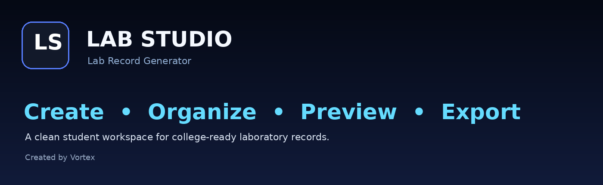

  # LAB STUDIO
  ### Lab Record Generator

  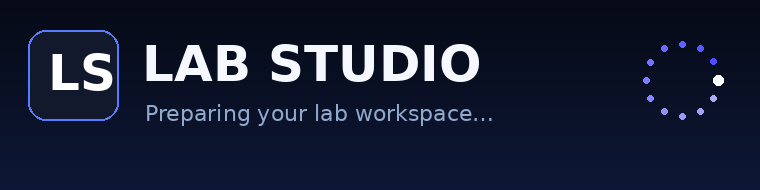

  <p>
    A student-focused workspace for creating, previewing, organizing, and exporting college-ready laboratory records.
  </p>

  <p>
    <a href="https://examflow.tamilarasanks2005.workers.dev/">🌐 Open the Live Site</a>
  </p>

  <p><strong>Created by Vortex</strong></p>
</div>

---

## 📌 Overview

**Lab Studio** is a browser-based lab-record workspace designed around a simple flow:

> **Enter student details → Add experiments → Attach GitHub links → Preview → Export**

The project combines a clean dashboard UI with document generation, QR codes, local workspace persistence, history, theme controls, GitHub repository assistance, and one-page compression options.

The current interface is designed to work as a local-first student tool: the main record, profile name, theme preference, and generated-history data are stored in the browser. GitHub repository lookup is the main feature that makes an external API request.

---

## 🌐 Live Site

**Live deployment:**

https://examflow.tamilarasanks2005.workers.dev/

> The link above is the project deployment supplied for this README.

---

## ✨ Feature Overview

| Feature | What it does |
|---|---|
| 🧑‍🎓 Student Information | Stores course title/code, student name, and register number for the record. |
| 🧪 Experiment Manager | Add, edit, reset, and remove individual experiments. |
| 📅 Optional Dates | Add an experiment date without making the field mandatory. |
| 🔗 GitHub Links | Attach a GitHub repository link to every experiment. |
| 🔎 GitHub Repository Picker | Fetch and display repositories for a GitHub username so a repository can be selected quickly. |
| 🔳 QR Codes | Generates a QR code for each GitHub link and places it in the document. |
| ✅ Validation | Preview/export controls remain unavailable until required information and valid GitHub links are present. |
| 👁️ Document Preview | Opens the generated A4 lab-record document in a full preview modal. |
| 📑 Page Count | Estimates the number of pages used by the normal layout. |
| 🗜️ One-Page Compression | When the record exceeds one page, the user can compress it to a single page. |
| 📄 Natural Pagination | Keeps the normal multi-page layout when compression is not selected. |
| 📥 PDF Export | Generates an A4 PDF from the entered record. |
| 📝 DOCX Export | Generates an editable Word document in the normal layout. |
| 📦 Compressed DOCX | The one-page DOCX mode renders the compact record as a single-page document image. |
| 🎓 Bonafide Merge | PDF export can optionally include the Bonafide Certificate. |
| 💡 Remember PDF Choice | Remembers the Bonafide download choice when enabled. |
| 🕘 History | Saves recent generated records locally and allows them to be reopened. |
| ♻️ Restore Previous Work | Detects a previous unsaved workspace and offers Restore / Start Fresh. |
| 🌙 Theme | Switches between light and dark appearance. |
| 👤 Profile Initial | Uses the first letter of the profile name instead of a profile image. |
| 💾 Local Workspace | Keeps core record/profile/settings/history data in browser storage. |
| 📱 Responsive UI | Adapts the workspace layout for smaller screens. |
| 🎨 Futuristic UI | Glass-style cards, gradient accents, responsive controls, and animated background elements. |

---

# 🖼️ Screenshot Gallery

The screenshots below document the current interface and the major workflows.

## 1. Dashboard

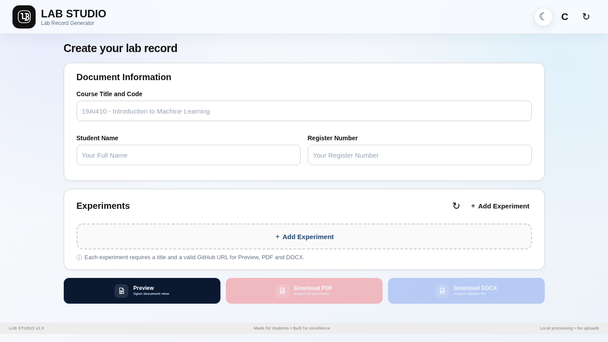

### What you see

- LAB STUDIO branding
- Course/document information area
- Experiment workspace
- Preview / PDF / DOCX action area
- Theme control
- Profile control
- Responsive editor layout

This is the main entry point for building a lab record.

---

## 2. Document Information + Experiments

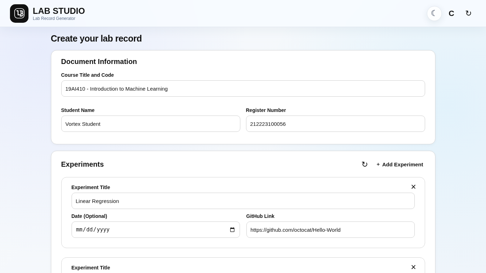

### Document Information

The user enters:

- Course Title and Code
- Student Name
- Register Number

### Experiment Manager

Each experiment contains:

- Experiment Title
- Optional Date
- GitHub Link
- Remove control when multiple experiments exist

The **Add Experiment** controls create additional experiment cards.

---

## 3. GitHub Repository Picker

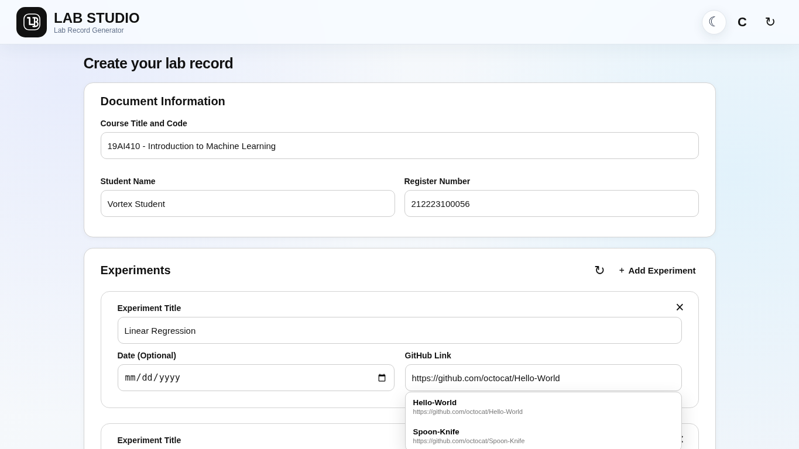

When a GitHub account/repository URL is entered, Lab Studio can query the GitHub API and show repository suggestions.

The picker displays repository name and URL so the user can select a matching project instead of typing every link manually.

> The repository names shown in this documentation image are public example repositories used to illustrate the picker UI.

---

## 4. Profile Menu

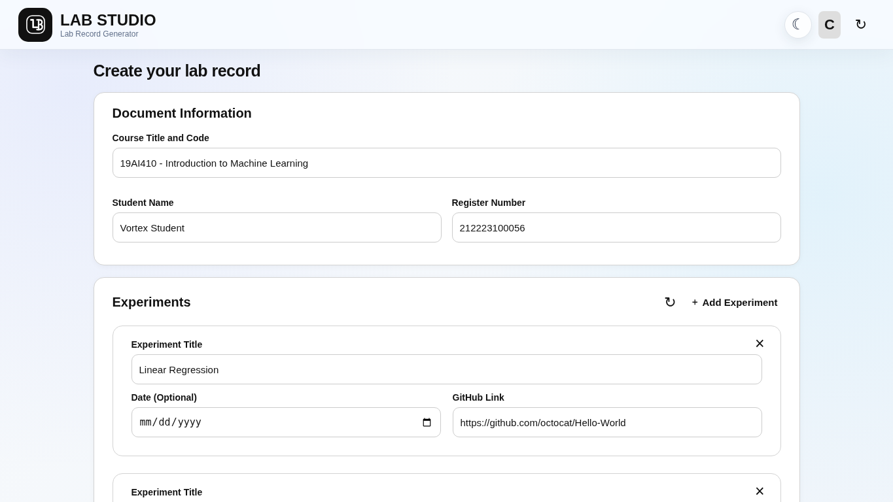

The profile menu provides a compact workspace panel with:

- Profile name editing
- First-letter profile identity
- History access
- Clear history
- Dark Mode toggle
- Settings entry
- Local-storage information

The profile is intentionally lightweight and image-free.

---

## 5. Profile Initial


The profile identity is driven by the entered profile name.

Examples:

```text
Vortex       → V
Tamil Arasan → T
College User → C
```

Only the initial is displayed in the top-right profile control.

---

## 6. Dark Theme

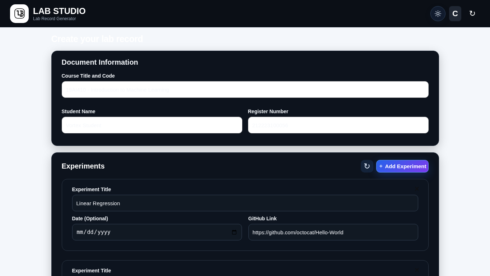

The theme control switches the interface into a dark workspace while preserving the same editor controls and document workflow.

The selected theme is persisted in the browser.

---

## 7. Document Preview + Page Compression

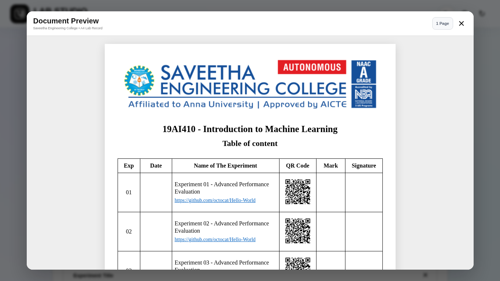

The Preview window renders the college-style document using:

- College logo
- Course title
- Table of content heading
- Experiment table
- GitHub links
- QR codes
- Mark column
- Signature column
- Student details and declaration

When the normal layout is longer than one page, the preview workflow exposes a **Compress to 1 Page** action.

The user can:

```text
Normal multi-page preview
        │
        ├── Keep normal pages
        │
        └── Compress to 1 Page
```

The preview UI exposes the current layout state so the user can switch back to normal pages when needed.

---

## 8. Download Compression Choice

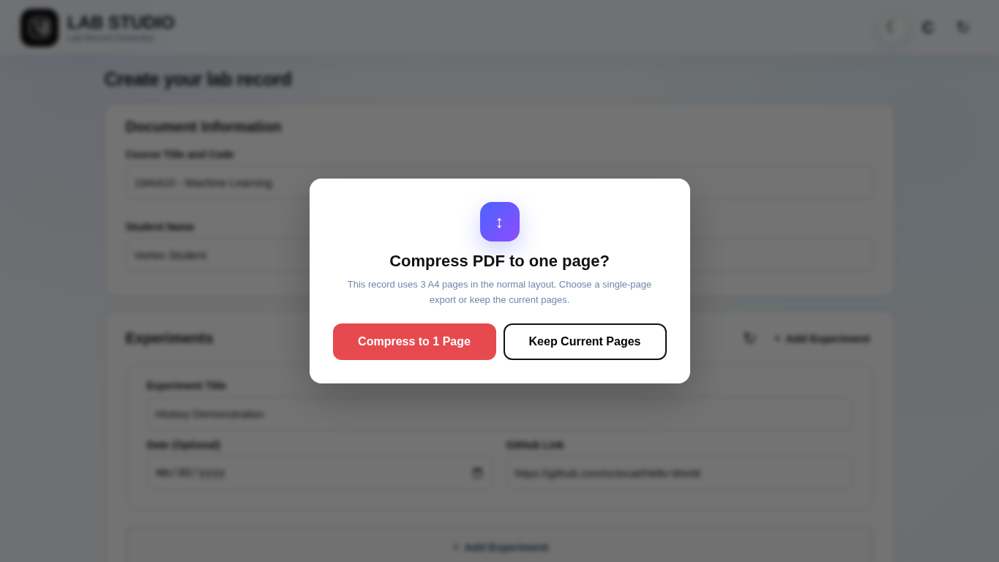

When an export is expected to use more than one normal A4 page, the download workflow asks what to do:

### Compress to 1 Page
Creates the compact one-page export.

### Keep Current Pages
Keeps the normal multi-page document layout.

This decision is made before PDF or DOCX generation.

---

## 9. Bonafide Certificate Option

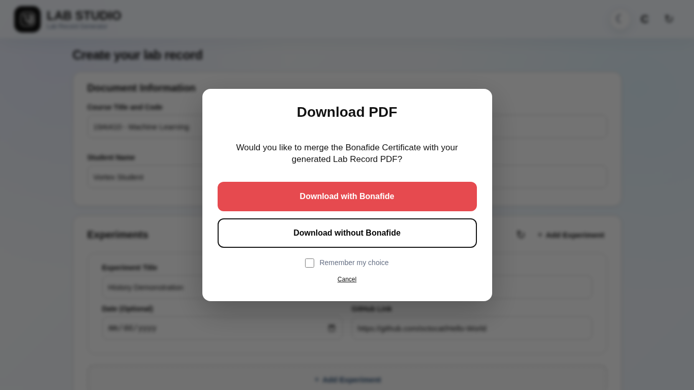

PDF generation includes an optional Bonafide Certificate workflow:

- **Download with Bonafide**
- **Download without Bonafide**
- **Remember my choice**
- **Cancel**

When the Bonafide option is selected, the application merges the Bonafide PDF with the generated lab-record PDF.

---

## 10. History

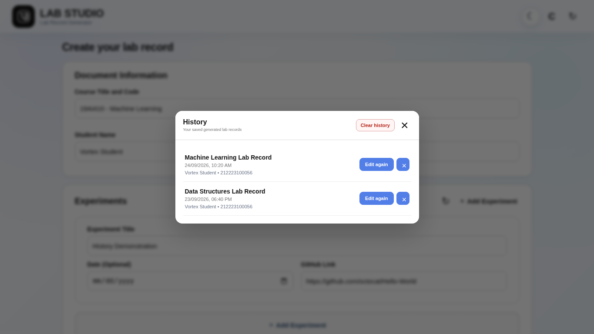

The History panel provides a local list of saved generated records.

Each record can be:

- Opened for editing again
- Deleted individually
- Removed in bulk through **Clear history**

The current implementation keeps the most recent **20 history entries**.

---

## 11. Restore Previous Work

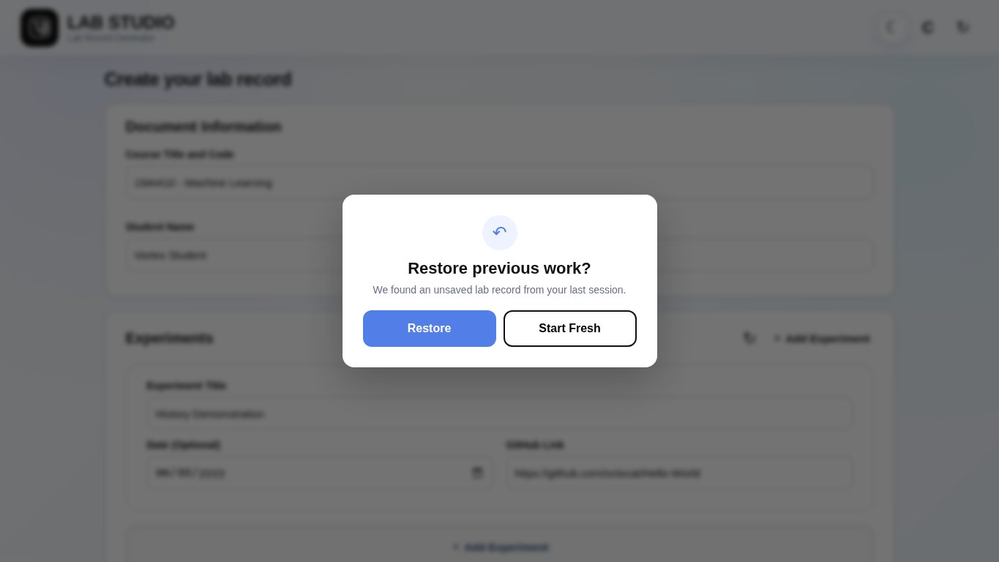

When the browser contains a previous workspace, Lab Studio can show a restore prompt:

- **Restore** → load the previous lab record back into the editor
- **Start Fresh** → discard the previous workspace and begin again

This helps prevent accidental loss of unfinished work.

---

# 🧩 Core Functions Explained

## Add Experiment

Adds another experiment card to the record.

```text
Experiments
   ├── Experiment 01
   ├── Experiment 02
   ├── Experiment 03
   └── + Add Experiment
```

## Remove Experiment

When multiple experiments exist, each card can be removed individually.

## Reset Experiments

Resets the experiment collection back to a single blank experiment.

## Reset Entire Record

Clears the complete record workspace, including student information and experiments.

## Date Formatting

Dates entered through the browser date field are formatted for the generated record.

## GitHub Validation

The application validates GitHub URLs before allowing document preview/export.

## QR Generation

A QR code is generated directly from each experiment's GitHub URL. This makes the final printed record scannable without requiring the reader to type the repository URL.

## Preview Generation

Preview uses the same document structure used for the export workflow, including the college logo, experiment table, QR codes, declaration, and learner information.

## PDF Export

The PDF generator creates an A4 portrait document and draws the lab-record content page by page.

## DOCX Export

The normal DOCX workflow creates an editable Word document using Word paragraphs, tables, and embedded QR images.

## One-Page Export

The compact export flow scales the document into a single A4 page. This is available when the user explicitly selects one-page compression.

## History

Generated records are serialized locally so users can return to a previous record without maintaining a server-side account.

## Theme

The interface stores the selected light/dark preference in browser storage and restores the preference on later visits.

## Profile

The profile name is local to the browser. The displayed avatar is derived from the first character of the profile name.

---

# 🔄 Typical User Workflow

```text
┌────────────────────┐
│  1. Open Lab Studio│
└─────────┬──────────┘
          ↓
┌────────────────────┐
│ 2. Enter student   │
│    information     │
└─────────┬──────────┘
          ↓
┌────────────────────┐
│ 3. Add experiments │
└─────────┬──────────┘
          ↓
┌────────────────────┐
│ 4. Add GitHub URLs │
└─────────┬──────────┘
          ↓
┌────────────────────┐
│ 5. Open Preview    │
└─────────┬──────────┘
          ↓
     More than 1 page?
        ↙       ↘
      NO         YES
      ↓           ↓
   Export   Compress or Keep
                  ↓
                Export
```

---

# 🛠️ Technology Stack

| Technology | Role |
|---|---|
| HTML5 | Application structure |
| CSS3 | UI, responsive layout, glass/futuristic styling, transitions |
| Vanilla JavaScript | Application state and interactions |
| jsPDF | PDF document generation |
| PDF-Lib | PDF merge operations, including Bonafide integration |
| docx | Word document generation |
| html2canvas | Rendering the compact one-page export |
| LocalStorage | Local workspace, profile, theme and history persistence |
| GitHub REST API | Repository lookup/suggestion feature |
| Embedded QR encoder | QR generation without a dedicated QR service |

---

# 🔐 Privacy & Data Handling

Lab Studio is designed around local browser storage for the main workspace.

### Stored locally

- Current lab record
- Profile name
- Theme preference
- Generated-record history
- PDF preference when “Remember my choice” is enabled

### External request

The GitHub repository picker can request repository data from the GitHub API when a GitHub account URL is entered.

### Important distinction

“Local processing” does not mean the browser makes no network requests at all. Core record state stays in the browser, while external CDN resources and GitHub lookup can require network access.

---

# ⚙️ Running the Project

The application is intended to run in a modern desktop or mobile browser.

### Local use

1. Place the project entry page and its required assets in a folder.
2. Open it in a modern browser, or serve the folder with a small local HTTP server.
3. Enter the document information.
4. Add experiments and GitHub links.
5. Open Preview.
6. Export PDF or DOCX.

### Deployment

The project can be deployed using a static hosting platform or another web host capable of serving the frontend assets.

The current public deployment is:

https://examflow.tamilarasanks2005.workers.dev/

---

# 📂 Documentation Package Structure

This README package contains documentation assets only.

```text
lab-studio-readme/
├── README.md
└── docs/
    ├── assets/
    │   ├── hero.png
    │   └── loading.gif
    └── screenshots/
        ├── 01-dashboard.png
        ├── 02-document-and-experiments.png
        ├── 03-github-picker.png
        ├── 04-profile.png
        ├── 05-dark-theme.png
        ├── 06-preview-compression.png
        ├── 09-download-compression-choice.png
        ├── 10-bonafide-option.png
        ├── 11-history.png
        └── 12-restore.png
```

> The application source HTML is intentionally **not included in this README package**.

---

# ✅ Feature Checklist

- [x] Student information form
- [x] Experiment creation
- [x] Experiment deletion
- [x] Experiment reset
- [x] Optional dates
- [x] GitHub URL validation
- [x] GitHub repository suggestions
- [x] QR code generation
- [x] A4 document preview
- [x] Natural multi-page export
- [x] One-page compression
- [x] PDF export
- [x] DOCX export
- [x] Bonafide PDF merge
- [x] Remember PDF preference
- [x] History
- [x] Clear history
- [x] Reopen history records
- [x] Restore previous work
- [x] Start Fresh
- [x] Light/Dark theme
- [x] Profile initial
- [x] Local browser persistence
- [x] Responsive UI
- [x] Futuristic animated interface

---

# 🚀 Future Upgrade Ideas

The current architecture leaves room for a larger Lab Studio ecosystem:

- Template builder for multiple colleges and departments
- Experiment library with reusable records
- Drag-and-drop experiment ordering
- OCR image → experiment extraction
- Signature drawing/upload system
- Custom fields and custom document layouts
- Workspace backup/import
- ZIP export containing PDF, DOCX and QR assets
- Optional account-based cloud sync
- PWA/offline installation
- Advanced print controls

---

# 👑 Creator

## Vortex

**Creator / Project identity:** Vortex

Lab Studio is built as a practical student productivity tool focused on clean records, quick exports, and a streamlined workflow.

---

<div align="center">
  
  <br><br>
  <strong>LAB STUDIO • CREATE • ORGANIZE • PREVIEW • EXPORT</strong>
  <br>
  <sub>Created by Vortex</sub>
</div>
